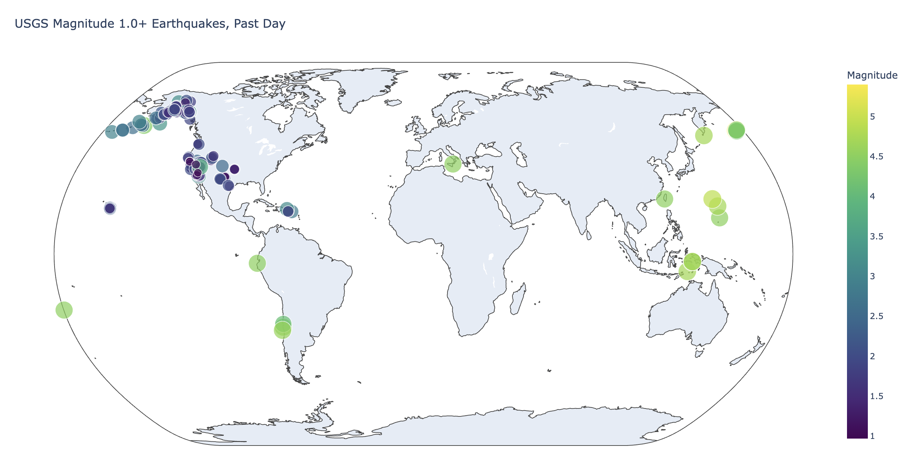

# Downloading Datasets with Python

This repository contains Python exercises and activities focused on **downloading and working with datasets**.

The code and activities in this repository are based on the book **Python Crash Course, 3rd Edition** by **Eric Matthes**.

---

## 📘 About the Book

**Python Crash Course, 3rd Edition** by Eric Matthes is a hands-on, project-based introduction to programming with Python.  
It teaches core programming concepts and applies them to practical projects such as data visualization, games, and web applications.

---

## 📂 Repository Purpose

The purpose of this repository is to:

- Practice Python programming
- Learn how to **download datasets using Python**
- Work with external data sources
- Gain experience handling and processing data

---

## 🧠 Contents

This repository may include:

- Python scripts for downloading datasets
- Data processing examples
- Practice exercises from the book
- Experiments with Python libraries and APIs

---

## 🛠 Technologies Used

- Python 3
- Requests / HTTP libraries
- JSON and data processing tools

---

## 📚 Learning Source

The activities in this repository are based on:

- **Book:** *Python Crash Course, 3rd Edition*  
- **Author:** Eric Matthes  
- **Publisher:** No Starch Press

---

## 📸 Screenshot

---

## ⚠️ Disclaimer

This repository is created for **learning and educational purposes only**.  
All exercises are inspired by the book *Python Crash Course, 3rd Edition* by Eric Matthes.

---

## 👤 Author

**Benidict Dulce**

GitHub: https://github.com/benidict1995
